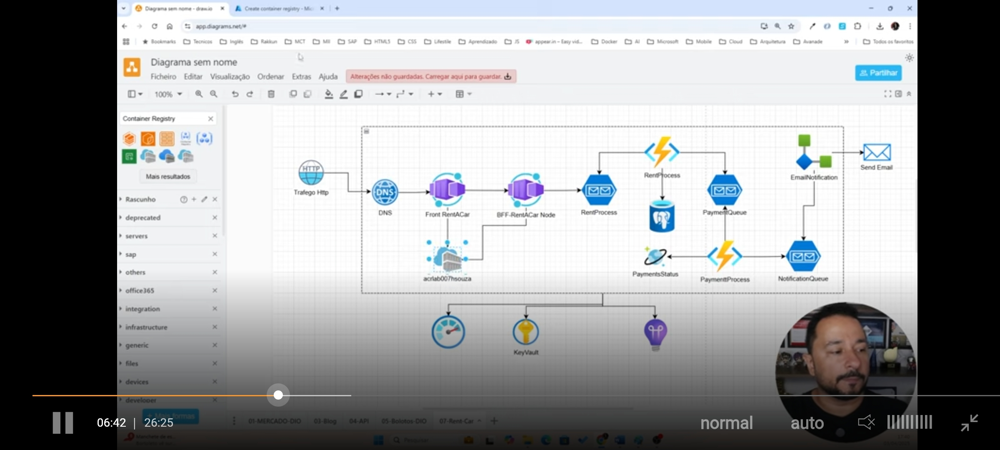

# azure-cloud-native-06
Construção de uma Aplicação de Aluguel de Carros totalmente Cloud-Native
Neste desafio o Henrique criou um app que recebe, em json, os dados de quem vai alugar um carro (nome, modelo do veículo, ano, tempo de locação, e valor do aluguel). 
O app está num container (usando o container app) que usa o Azure Container Registry (ACR), o App envia uma mensagem (que fica numa fila) no Service Bus (rentprocess) que dispara uma Azure Function, que armazenanos dados em um banco Postgre SQL do Azure. a função  também envia uma mensagem na fila de outro Service Bus (paymentqueue) que dispara outra função (paymentprocess) que armazena os dados em um  banco de dados cosmosdb e envia uma outra mensagem para outro service bus (notificationqueue) que classifica os pagamentos em: aprovado, em análise, e reprovado; e manda os dados de quem foi aprovado por e-mail através do Logic App. A seguir podemos ver a arquitetura do app:

